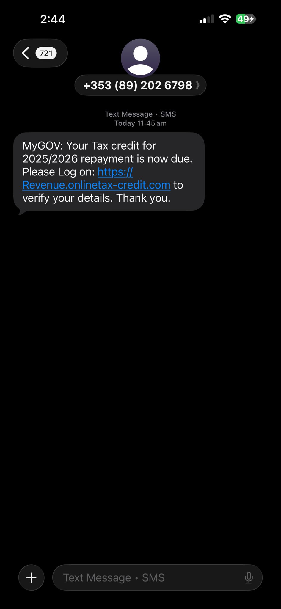
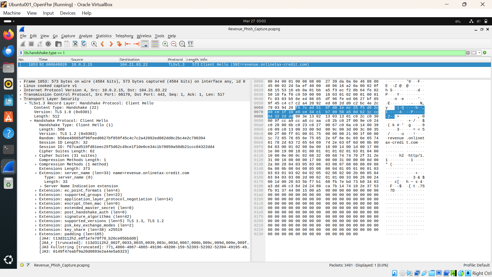

# 🛡️ Real-World SOC Investigation: Ireland Revenue Smishing Analysis
**Analyst:** Sarath Pulicherla | **Location:** Ireland 🇮🇪  
**Case ID:** IR-2026-03-IE | **Status:** 🟥 Critical / True Positive

---

## 📌 1. Executive Summary
This project documents a deep-dive investigation into a live **Smishing (SMS Phishing)** campaign targeting Irish taxpayers. Using a SOC-centric approach, I analyzed the attack vector, bypassed advanced server-side evasion, and performed network traffic analysis to confirm malicious intent.

---

## 📩 2. Incident Overview
- **Attack Vector:** SMS Social Engineering (Tax Refund Lure).
- **Targeting Logic:** **High-Confidence iOS Targeting.** Evidence shows the campaign specifically targets iPhone users to leverage mobile-specific browser vulnerabilities and bypass desktop-based security filters.
- **Phishing Domains:** `revenue.onlinetax-credit.com` and `revenue.myaccount-claim.com`.
- **Infrastructure:** Hosted behind Cloudflare (IPs: `104.21.83.22`, `172.67.167.84`).

---

## 🔍 3. Advanced Technical Investigation

### 🕵️ 3.1 Bypassing Evasion (User-Agent Spoofing)
The attacker utilizes **Cloaking/Redirection**. Desktop/Linux users are redirected to the legitimate `revenue.ie`.
- **Finding:** The backend is configured to only serve the phishing payload to mobile User-Agents (primarily iOS).
- **Action:** Utilized `curl` with a spoofed **iOS User-Agent** to bypass the filter and reveal the malicious HTML structure.

### 📡 3.2 Network Traffic Analysis (Wireshark)
I captured the encrypted communication between the analyst VM and the malicious host.
- **Discovery:** Identified the domain via **SNI (Server Name Indication)** in the TLSv1.3 Client Hello (Packet #1053).
- **Correlation:** Confirmed the destination IP resolves to the Cloudflare-protected phishing infrastructure.

---

## 🖼️ 4. Evidence Gallery

| SMS Lure (iPhone) | Wireshark SNI Proof | Phishing UI (Spoofed) |
| :---: | :---: | :---: |

|    |  |

---

## 🧾 5. Indicators of Compromise (IOCs)
| Type | Value |
| :--- | :--- |
| **Domain** | revenue.onlinetax-credit.com |
| **Target OS** | iOS (iPhone) |
| **Source Phone** | +353 (85) 141 4277 |
| **Handshake SNI** | revenue.onlinetax-credit.com |

---
## 🙋‍♂️ Author
**Sarath Pulicherla** *MSc Cybersecurity (2:1)* | [LinkedIn](https://www.linkedin.com/in/sarath-pulicherla/)
