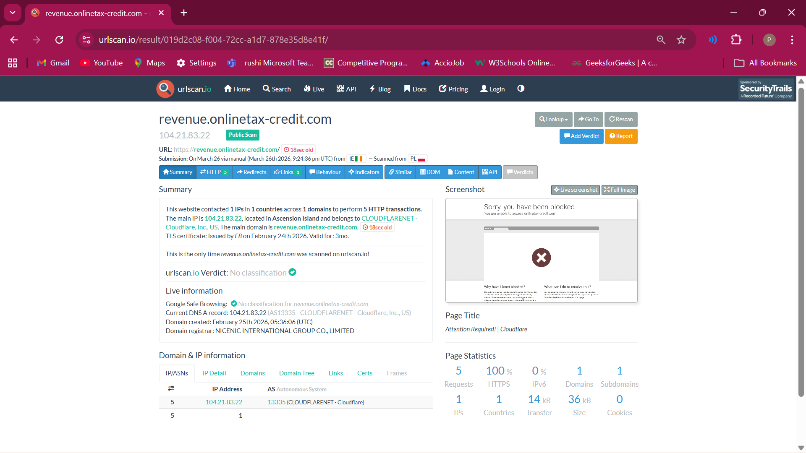

# 🛡️ Incident Report: Revenue.ie Smishing & Identity Theft Analysis
**Analyst:** Sarath Pulicherla  
**Date:** March 27, 2026  
**Case ID:** IR-2026-03-IE  
**Status:** Confirmed Malicious (True Positive)

---

## 1. Executive Summary
This report documents a **Smishing** (SMS Phishing) attack targeting residents in Ireland. The attacker impersonated the **Revenue Commissioners** to harvest Personal Public Service (PPS) numbers and financial credentials. This investigation covers the lifecycle from **Initial Access** to **Containment**.

---

## 2. Technical Investigation

### A. Initial Access (The Hook)
The attack vector was an unsolicited SMS using a "High Urgency" lure regarding a 2025/2026 tax repayment.
* **Lure:** "MyGOV: Your Tax credit... repayment is now due."
* **Malicious URL:** `https://revenue.onlinetax-credit.com`

### B. Infrastructure Analysis (OSINT)
Using **nslookup** and **urlscan.io**, the following infrastructure was identified:
* **IP Address:** 104.21.83.22 (Proxied via Cloudflare to hide the origin server).
* **Registrar:** NICENIC INTERNATIONAL GROUP CO., LIMITED.
* **Domain Age:** Created February 25, 2024.

### C. Defense Evasion (Cloaking)
The attacker implemented **User-Agent Filtering**. Desktop Chrome users are redirected to the legitimate `revenue.ie` site, while mobile users are served the phishing page. This is designed to bypass automated security crawlers.

---

## 3. The Impact: How Data is Misused
If a victim enters their data into this form (PPS Number, DOB, Password), the attacker gains **Full Identity Control**.

### ⚠️ Potential Consequences:
* **Financial Fraud:** Attackers can use the captured credentials to log into real banking or Revenue "myAccount" portals to divert actual tax refunds to their own accounts.
* **Identity Theft:** With a PPS number and Date of Birth, attackers can apply for loans, credit cards, or social welfare benefits in the victim's name.
* **Credential Stuffing:** Because many people reuse passwords, the attacker will attempt to use these credentials on other sites like Gmail, Facebook, or Amazon.
* **Social Engineering:** The attacker can sell this "Lead" to other criminals, who may call the victim pretending to be their bank (Vishing) to gain even more access.

---

## 4. Cybersecurity Framework Mapping

### 🛡️ MITRE ATT&CK Tactic Mapping
| ID | Tactic | Technique |
| :--- | :--- | :--- |
| **T1566.002** | Initial Access | **Phishing:** Spearphishing Link (via SMS). |
| **T1594** | Reconnaissance | **Search Victim-Owned Websites:** Cloning the Revenue portal. |
| **T1036** | Defense Evasion | **Masquerading:** Using a look-alike domain. |

### 🚨 NIST Incident Response Lifecycle
1. **Detection:** Verified the suspicious URL and domain mismatch.
2. **Analysis:** Conducted DNS and IP analysis via Linux terminal.
3. **Containment:** Reported the domain to **Google Safe Browsing** to block user access.

---

## 5. Risk Management Strategy
* **Likelihood:** High (Due to the urgency of "Tax Refunds").
* **Impact:** Critical (Potential for total financial loss).
* **Recommendation:** Organizations should implement **DMARC/SPF** and user awareness training to mitigate these threats.

---

## 6. Glossary for Non-Technical Readers
* **Smishing:** Phishing via SMS (Text message).
* **Proxy (Cloudflare):** A middle-man service that hides a website's real location.
* **True Positive:** A confirmed, real security threat.
* **PPS Number:** A unique identifier in Ireland; losing this is a major privacy risk.

---
**Reported to Google Safe Browsing:** ✅ Successful  

