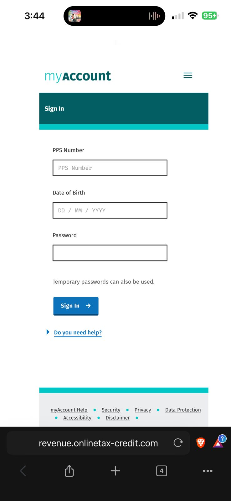
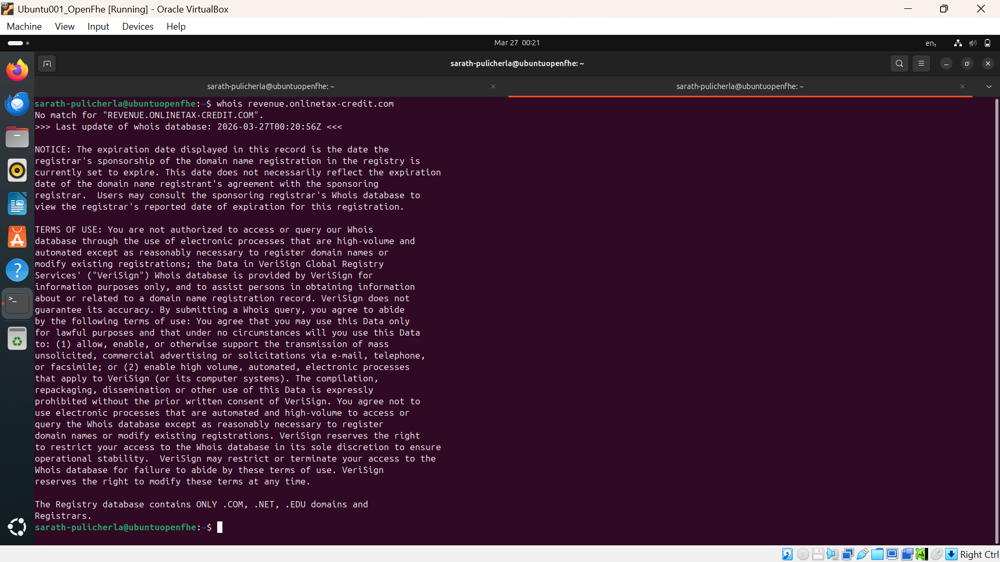
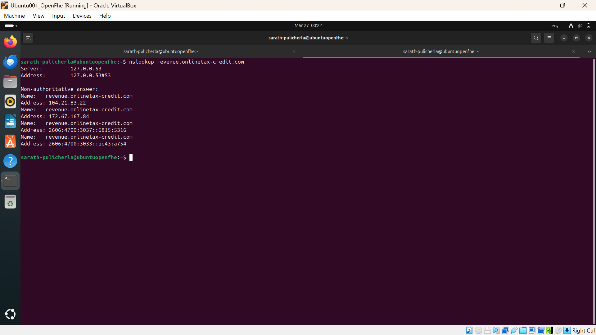
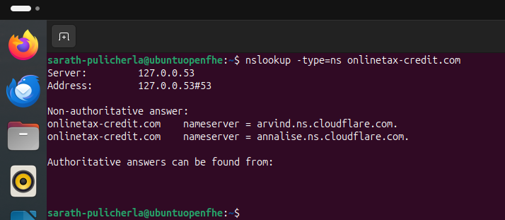
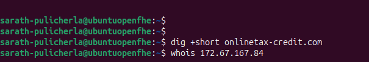
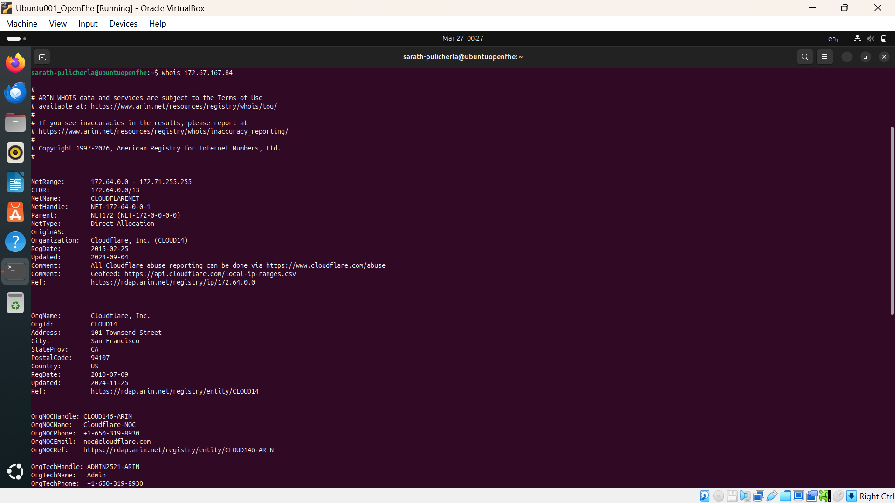
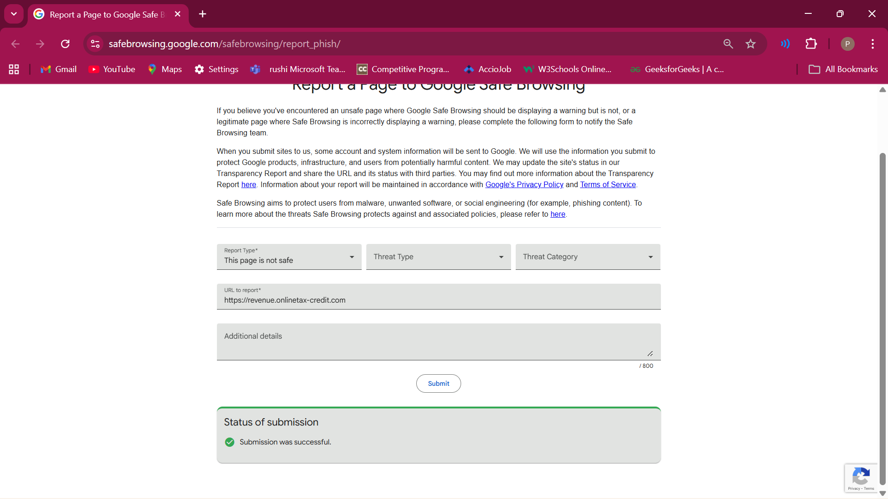

# Phishing Investigation Report – Revenue SMS Scam (Ireland)

---

## 1. Introduction

This report documents a real-world phishing investigation conducted from a Security Operations Center (SOC) perspective. The investigation was initiated after receiving a suspicious SMS claiming to be from the Irish tax authority.

The objective was to validate whether the message was malicious and to analyze the infrastructure, behavior, and risks associated with the suspected phishing campaign.

---

## 2. Incident Overview

- **Attack Vector:** SMS (Smishing)
- **Theme:** Tax refund notification
- **Impersonated Entity:** Revenue (Ireland)
- **Malicious URL:** `revenue.onlinetax-credit.com`

The message attempted to lure the victim into clicking a link and entering sensitive information such as PPS number, date of birth, and account credentials.

---

## 3. Initial Observations

- Domain mismatch (`.com` instead of official `.ie`)
- Urgent language encouraging immediate action
- Suspicious login page requesting sensitive data
- Majority of targets observed using **iPhones**
- Website behavior inconsistent with legitimate services

---

## 4. Evidence Collection

### 4.1 Suspicious SMS

  

---

### 4.2 Phishing Login Page

  

---

### 4.3 WHOIS Analysis

  

**Findings:**
- No detailed WHOIS information available
- Indicates newly registered or privacy-protected domain

---

### 4.4 DNS Resolution

  

**Findings:**
- Domain resolves to:
  - 104.21.83.22
  - 172.67.167.84

---

### 4.5 Nameserver Analysis

  

**Findings:**
- Cloudflare nameservers used
- Indicates proxy-based infrastructure masking origin server

---

### 4.6 Root Domain Check

  

**Findings:**
- Root domain inactive
- Only phishing subdomain operational

---

### 4.7 IP Address Analysis

  

**Findings:**
- Hosted on Cloudflare network
- Actual attacker server hidden

---

### 4.8 URLScan Analysis

  

**Findings:**
- Domain recently created
- No classification in threat intelligence feeds
- TLS certificate short-lived

---

### 4.9 Google Safe Browsing

  

**Findings:**
- Not yet flagged as malicious
- Indicates early-stage phishing campaign

---

### 4.10 Wireshark Analysis (SNI)

  

**Findings:**
- TLS SNI reveals connection to phishing domain
- Confirms communication with attacker infrastructure

---

### 4.11 Network Behavior Analysis

  

**Findings:**
- Encrypted traffic observed
- Increased activity during form interaction

---

## 5. Behavioral Analysis of Phishing Site

- All UI elements (Help, Security, Menu, etc.) redirect back to login page
- No real navigation functionality
- Indicates **static credential harvesting page**
- No backend validation observed

---

## 6. Evasion Techniques Identified

- Mobile-only content delivery (primarily targeting iPhone users)
- Desktop browsers redirected to legitimate site
- Likely **User-Agent filtering**
- Prevents detection by analysts and automated tools

---

## 7. Indicators of Compromise (IOCs)

| Type | Value |
|------|------|
| Domain | revenue.onlinetax-credit.com |
| Root Domain | onlinetax-credit.com |
| IPs | 104.21.83.22, 172.67.167.84 |
| Nameservers | arvind.ns.cloudflare.com |
| TLS Indicator | SNI reveals phishing domain |

---

## 8. Risk Analysis

### Risks:
- Credential theft
- Identity fraud
- Financial exploitation

### Impact:
- Unauthorized access to accounts
- Misuse of personal identity (PPS number, DOB)
- Potential banking fraud

---

## 9. What Happens if Attacker Gets Your Data

If a victim enters details:

- Credentials may be used for:
  - Account takeover
  - Tax account manipulation
- Personal data can be:
  - Sold on dark web
  - Used for identity fraud
- Attackers may attempt:
  - Password reuse attacks
  - Social engineering follow-ups

---

## 10. Threat Intelligence Correlation

During investigation, it was observed that the **Revenue authority issued warnings about phishing SMS and emails**.

This confirms:
- The attack is part of an **active phishing campaign**
- The investigation aligns with real-world threat activity

---

## 11. MITRE ATT&CK Mapping

| Technique | ID |
|----------|----|
| Phishing | T1566 |
| User Execution | T1204 |
| Credential Harvesting | T1056 |

---

## 12. Mitigation Strategies

### For Individuals:
- Do not click links from SMS messages
- Verify official domains manually
- Enable Multi-Factor Authentication (MFA)
- Avoid entering sensitive data on unknown sites

### For Organizations:
- Implement email/SMS filtering
- User awareness training
- Threat intelligence monitoring
- Domain monitoring for impersonation

---

## 13. Awareness Points

- Government agencies do not ask for sensitive details via SMS links
- Always check domain carefully
- Phishing attacks increasingly target **mobile users**
- Visual similarity does not guarantee legitimacy

---

## 14. Lessons Learned

- New phishing domains often evade detection tools
- Manual investigation is critical in early stages
- DNS and infrastructure analysis provide strong indicators
- Attackers use Cloudflare to hide origin servers
- Mobile-targeted phishing is increasing
- Evasion techniques are actively used in real attacks

---

## 15. Conclusion

This investigation confirms a **high-confidence phishing attack** targeting users through SMS.

The attacker leveraged:
- Domain impersonation
- Cloudflare proxy infrastructure
- Mobile-targeted delivery
- Static credential harvesting page
- Evasion techniques to avoid detection

This case highlights the importance of:
- Critical analysis
- Manual validation
- User awareness

---

## 16. Author

Sarath Pulicherla  
Aspiring SOC Analyst | Cybersecurity Learner
